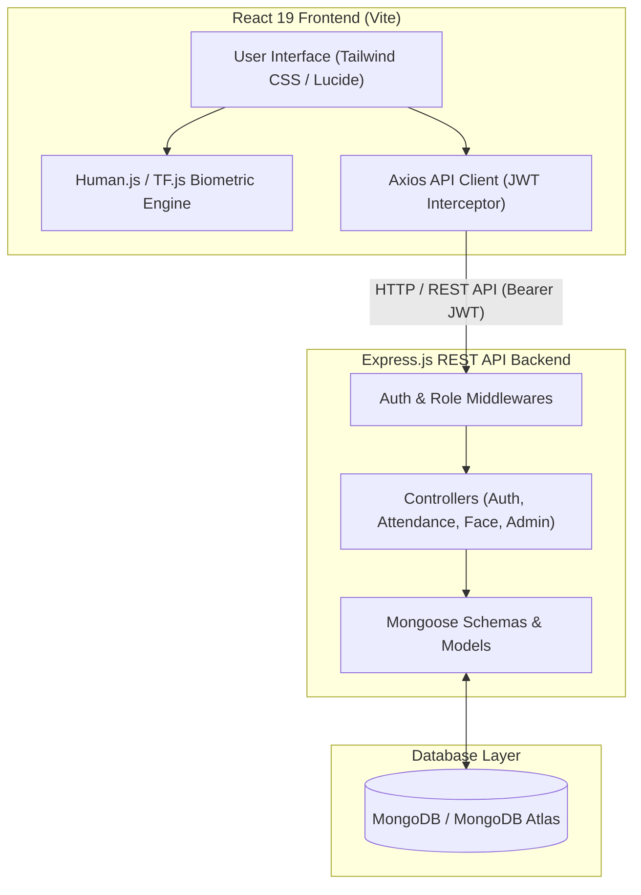
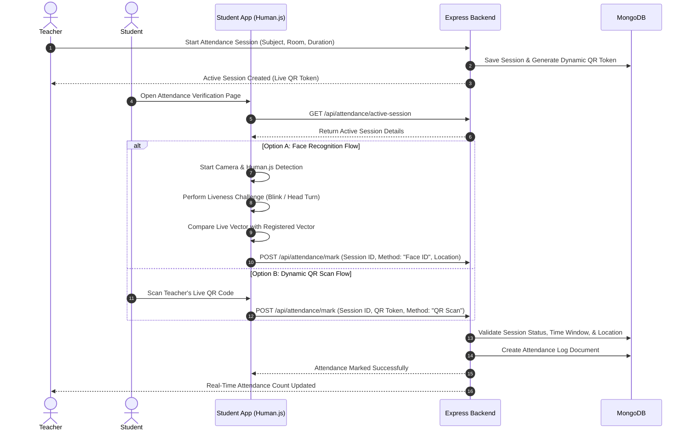

# Attendify

**Attendify** is an AI-powered smart attendance management web application built on the MERN (MongoDB, Express.js, React, Node.js) stack. Designed for higher education institutions and modern academic environments, Attendify eliminates fraudulent and proxy attendance through real-time computer vision, liveness detection, facial verification, and dynamic QR codes, while streamlining attendance workflows for students, faculty, and administrators.

---

## Features

### Student
- **Student Dashboard**: Live attendance statistics, overall compliance status (Compliant / At-Risk), subject breakdown cards, recent check-in timeline, and quick verification access.
- **Biometric Attendance Verification**: Real-time web camera face verification using facial landmark extraction, vector embedding matching, anti-spoofing liveness challenges (blink detection and head turns), and multi-face rejection.
- **Dynamic QR Code Attendance**: Scan refreshing 30-second time-bound QR code tokens generated during active attendance sessions.
- **Face Profile Registration**: Secure self-service biometric enrollment on profile creation using quality validation checks (centered orientation, lighting, single face).
- **Attendance Records & History**: Detailed ledger of past attendance entries filterable by date, subject, faculty member, room, verification method, and status (Present, Absent, Late).
- **Smart Curriculum**: View enrolled subjects, syllabus completion percentages, weekly timetables, active assignments, and upcoming examination schedules.
- **Notifications**: System alerts for active attendance sessions, upcoming assignment deadlines, room changes, and low attendance warnings.
- **Profile & Preferences**: Manage personal information, security credentials, and light/dark UI themes.

### Teacher
- **Faculty Dashboard**: Real-time overview of today's classes, total enrolled students, average class attendance percentage, and active session controls.
- **Attendance Session Management**: Create, start, and end live attendance sessions with customizable subjects, lecture rooms, duration limits, and automated 30-second dynamic QR code generation.
- **Student Roster Management**: Comprehensive student directory with search, compliance status filters (All, Compliant, At Risk), attendance percentage sorting, and student detail inspection modals.
- **Class Analytics & Insights**: Interactive charts showing overall class health, subject-by-subject attendance comparisons, compliance distribution, at-risk student lists, and exportable PDF/Excel class reports.
- **Course Management**: Curriculum hub to track syllabus completion goals, create and assign student coursework, schedule mid-term and final examinations, and adjust timetable slots.
- **Notifications & Profile**: Faculty-tailored notification center for class alerts, low attendance flags, assignment submissions, and professional profile management.

### Admin
- **Administrative Dashboard**: Institution-wide metrics (total users, active students, faculty members, total subjects, system health score), real-time system activity log, and quick actions.
- **User Management**: Role-based access management to view, create, filter, and edit accounts for Students, Teachers, and System Administrators.
- **Department Management**: Create and configure academic departments (e.g., Computer Science, Information Technology, Electronics & Communication) with department code mappings.
- **Subject & Course Allocation**: Assign subjects to departments and faculty members, configure credit hours, and set syllabus completion milestones.
- **Institutional Timetable**: Manage college-wide weekly class schedules, lecture room allocations, and time slots.
- **Attendance Master Logs**: Central audit ledger of all attendance entries across departments with search and filtering by date, method, and status.
- **Reports & Auditing**: Export institutional attendance statistics into formatted PDF and Excel documents for regulatory and academic compliance.
- **System Audit & Security Logs**: Comprehensive security event tracking log capturing biometric spoofing attempts, multi-face detection rejections, threshold failures, and system maintenance snapshots.
- **System Settings**: Global system configuration and institution profile management.

### Attendance & Security
- **Biometric Face Verification**: 128/512-dimensional facial descriptor vector matching using Human.js and TensorFlow.js models directly in the client browser.
- **Liveness Detection & Anti-Spoofing**: Real-time blink tracking and head-turn movement validation to reject static photos, video replays, and mask attempts.
- **Multi-Face Rejection**: Automatic rejection when multiple faces are detected within the camera frame.
- **Dynamic QR Refresh**: Cryptographically unique QR code tokens that auto-expire every 30 seconds to prevent screen recording and screenshot sharing.
- **Geolocation Verification**: Distance verification against designated campus/classroom coordinates.
- **Role-Based Access Control (RBAC)**: Strict role separation (`student`, `teacher`, `admin`) enforced at client route guards and backend API endpoints.
- **JWT & Password Hashing**: Stateless authentication using JSON Web Tokens (JWT) stored in secure storage and password encryption via `bcryptjs` with salt rounds.

---

## Tech Stack

### Core Technologies

| Layer | Technology | Description |
| :--- | :--- | :--- |
| **Frontend Framework** | React 19 + Vite | High-performance single-page application framework and build tool |
| **Styling & Icons** | Tailwind CSS + Lucide React | Utility-first styling framework with modern UI icon library |
| **Animation & Charts** | Framer Motion + Recharts | Smooth layout transitions and interactive SVG data charts |
| **Backend Runtime** | Node.js + Express.js | Event-driven JavaScript backend server environment |
| **Database** | MongoDB + Mongoose | NoSQL document database with strict ODM schema modeling |
| **Authentication** | JWT + bcryptjs | Token-based stateless authentication and password hashing |
| **Computer Vision / AI** | `@vladmandic/human` + `@tensorflow/tfjs` | Real-time face detection, descriptor extraction, and liveness analysis |
| **QR Code Scanning** | `html5-qrcode` | Browser-based QR code camera scanning engine |
| **Export Utilities** | `jsPDF` + `jspdf-autotable` + `xlsx` | Client-side PDF generation and Excel sheet exporter |

---

## System Architecture



### Architecture Highlights
1. **Client-Side Biometric Computation**: Face detection, landmark extraction, and liveness scoring are calculated locally using browser-based WebGL/TensorFlow execution to minimize server load and protect raw camera frames.
2. **Stateless JWT Authorization**: API requests carry a signed JWT token in HTTP Authorization headers (`Bearer <token>`). Route middlewares (`authMiddleware` and `roleMiddleware`) inspect the payload and enforce role permissions.
3. **Data Protection**: Raw images are processed transiently in memory and never transmitted or saved to disk; only numerical facial embedding vectors (descriptors) are stored in MongoDB.

---

## Attendance Flow



---

## User Roles

| Role | Key Responsibilities | Primary Access Routes |
| :--- | :--- | :--- |
| **Student** | Mark attendance via Face/QR, register face biometric profile, view overall compliance, check subject attendance history, view curriculum & timetable. | `#/dashboard`, `#/attendance`, `#/curriculum`, `#/progress`, `#/profile` |
| **Teacher** | Create & manage attendance sessions, broadcast dynamic QR codes, inspect student rosters, view class analytics, manage course syllabi & assignments. | `#/teacher`, `#/attendance`, `#/roster`, `#/analytics`, `#/curriculum`, `#/profile` |
| **Admin** | System-wide monitoring, user management, department & subject allocation, timetable configuration, security audit log review, report export. | `#/admin` (Overview, Users, Departments, Subjects, Timetable, Logs, Reports) |

---

## Project Structure

```text
Attendify/
├── client/                      # React Frontend Application
│   ├── src/
│   │   ├── assets/              # Logos, hero images, and branding assets
│   │   ├── components/          # Reusable UI components (Button, Card, Badge, Modal)
│   │   ├── context/             # React Context Providers (ThemeContext, NotificationContext)
│   │   ├── data/                # Fallback data definitions
│   │   ├── layouts/             # Responsive role-aware Layout wrapper
│   │   ├── pages/               # Application page views
│   │   │   ├── AdminDashboard.jsx
│   │   │   ├── AnalyticsPage.jsx
│   │   │   ├── AttendancePage.jsx
│   │   │   ├── LandingPage.jsx
│   │   │   ├── LoginPage.jsx
│   │   │   ├── NotificationsPage.jsx
│   │   │   ├── ProfilePage.jsx
│   │   │   ├── ProgressPage.jsx
│   │   │   ├── SettingsPage.jsx
│   │   │   ├── SmartCurriculum.jsx
│   │   │   ├── StudentDashboard.jsx
│   │   │   ├── TeacherDashboard.jsx
│   │   │   └── TeacherStudentsPage.jsx
│   │   ├── services/            # Axios API integration modules
│   │   ├── App.jsx              # Main routing configuration
│   │   └── main.jsx             # React application entry point
│   ├── index.html
│   ├── package.json             # Frontend dependencies & scripts
│   └── vite.config.js           # Vite bundler configuration
│
├── server/                      # Express.js REST API Backend
│   ├── config/                  # Database connection configuration (db.js)
│   ├── controllers/             # Request handlers (Auth, Attendance, Admin, Face, etc.)
│   ├── middleware/              # Authentication, Role Guard, Error Handler middlewares
│   ├── models/                  # Mongoose Schemas (User, Student, Attendance, AuditLog, etc.)
│   ├── routes/                  # Express REST Endpoint routers
│   ├── utils/                   # Helper functions (JWT Token generator, Notification helper)
│   ├── .env                     # Server environment configuration
│   ├── app.js                   # Express app setup and middleware configuration
│   ├── package.json             # Backend dependencies & scripts
│   ├── seed.js                  # Database seeder script
│   └── server.js                # Server bootstrap file
│
├── .gitignore                   # Version control ignore rules
└── README.md                    # Project documentation
```

---

## Installation & Setup

### Prerequisites
Ensure you have the following installed on your system:
- **Node.js**: `v18.0.0` or higher
- **npm**: `v9.0.0` or higher
- **MongoDB**: Local MongoDB instance (`mongodb://localhost:27017`) or a **MongoDB Atlas** cloud cluster URI
- **Git**: Installed for repository cloning

---

### 1. Clone Repository
```bash
git clone https://github.com/sanyam-07/Attendify.git
cd Attendify
```

---

### 2. Backend Setup
Navigate to the `server` directory and install the required dependencies:
```bash
cd server
npm install
```

Create a `.env` file inside the `server/` directory:
```env
PORT=5000
NODE_ENV=development
MONGODB_URI=mongodb://localhost:27017/attendify
JWT_SECRET=your_jwt_super_secret_key_change_in_production
JWT_EXPIRE=30d
```

*(Optional)* Seed the database with initial demo departments, subjects, students, teachers, and attendance sessions:
```bash
npm run seed
```

Start the backend server in development mode:
```bash
npm run dev
```
The server will start listening at `http://localhost:5000`.

---

### 3. Frontend Setup
Open a new terminal window, navigate to the `client` directory, and install dependencies:
```bash
cd client
npm install
```

Start the Vite development server:
```bash
npm run dev
```
The application will open in your browser at `http://localhost:5173`.

---

## Demo Credentials

You can use the pre-seeded accounts below to test role-specific workflows:

| Role | Email Address | Password | Context |
| :--- | :--- | :--- | :--- |
| **System Admin** | `admin@attendify.com` | `password123` | Institutional management, audit logs, reports |
| **Teacher** | `rahul.sharma@attendify.com` | `password123` | Attendance sessions, roster, analytics |
| **Student** | `aman.kumar@attendify.com` | `password123` | Verification, history, curriculum |

> **Note**: *These credentials are provided strictly for local development and demonstration purposes.*

---

## API Overview

The backend exposes a modular REST API prefixed with `/api`:

### Authentication (`/api/auth`)
- `POST /api/auth/login` - Authenticate user & issue JWT token
- `POST /api/auth/register` - Register a new user account
- `GET /api/auth/me` - Fetch authenticated user profile
- `PUT /api/auth/update-profile` - Update user profile information
- `PUT /api/auth/change-password` - Update account password

### Attendance & Sessions (`/api/attendance`)
- `POST /api/attendance/session/start` - Create and launch an attendance session (Teacher)
- `POST /api/attendance/session/end` - Close an active session (Teacher)
- `GET /api/attendance/active-session` - Retrieve active class session details
- `POST /api/attendance/mark` - Submit student attendance verification
- `GET /api/attendance/history` - Fetch student/class attendance log history

### Biometric Face Verification (`/api/face`)
- `POST /api/face/register` - Store 128/512-dimensional face embedding vector
- `POST /api/face/verify` - Compare live camera embedding against stored vector
- `GET /api/face/status` - Check student face registration status

### Administration & Audit (`/api/admin`)
- `GET /api/admin/overview` - Retrieve system statistics & metrics
- `GET /api/admin/users` - Fetch system user roster with role filters
- `GET /api/admin/audit-logs` - Retrieve security audit & event logs
- `GET /api/admin/reports` - Generate institutional attendance export data

### Core Academic Services
- `/api/students` - Student directory & profile endpoints
- `/api/teachers` - Faculty management & class details
- `/api/subjects` - Course subjects & syllabus percentage updates
- `/api/departments` - Academic department configurations
- `/api/timetable` - Institutional class schedules
- `/api/assignments` - Student coursework & assignment submission tracking
- `/api/exams` - Examination schedules & hall locations
- `/api/notifications` - System and targeted notification delivery
- `/api/analytics` - Student compliance & class attendance analytics

---

## Security Architecture

- **Token Security**: Stateless JSON Web Tokens (JWT) signed with HMAC-SHA256 encryption.
- **Password Hashing**: Passwords stored as one-way cryptographic hashes via `bcryptjs` with salt generation.
- **Biometric Privacy**: Face images are processed directly in browser client RAM. Only anonymized numerical feature vectors (descriptors) are stored in MongoDB.
- **Spoofing Prevention**: Blinking and head movement detection algorithms prevent identity fraud via static printed photos or video screens.
- **Audit Trails**: Security actions (spoof detection, threshold failures, multi-face frame rejections) are logged in the `AuditLog` collection.

---

## Database Models

The MongoDB database contains 13 Mongoose schemas:

1. **`User`**: Core identity model (`name`, `email`, `password`, `role`, `phone`).
2. **`Student`**: Academic profile (`user`, `enrollmentNo`, `department`, `semester`, `overallAttendance`, `faceRegistered`).
3. **`Teacher`**: Faculty profile (`user`, `employeeId`, `department`, `subjects`).
4. **`Subject`**: Course definition (`name`, `code`, `department`, `teacher`, `credits`, `syllabusPercentage`).
5. **`Department`**: Academic branch schema (`name`, `code`, `description`).
6. **`AttendanceSession`**: Active session state (`teacher`, `subject`, `room`, `classId`, `isActive`, `qrCodeToken`).
7. **`Attendance`**: Verification record (`student`, `subject`, `faculty`, `status`, `method`, `session`, `verifiedAt`).
8. **`Face`**: Biometric descriptor vector (`user`, `descriptor` float array, `registeredAt`).
9. **`Timetable`**: Weekly schedule slot (`subject`, `dayOfWeek`, `startTime`, `endTime`, `room`, `teacherName`).
10. **`Assignment`**: Coursework item (`title`, `subject`, `teacherName`, `dueDate`, `status`).
11. **`Exam`**: Exam schedule item (`title`, `subject`, `examType`, `room`, `examDate`, `duration`).
12. **`Notification`**: System alert (`title`, `message`, `receiverType`, `type`, `priority`, `actionUrl`, `isRead`).
13. **`AuditLog`**: System security ledger (`admin`, `action`, `entityType`, `description`, `metadata`, `createdAt`).

## Future Enhancements

- **Progressive Web App (PWA)**: Offline caching support for student timetables and push notifications.
- **Kiosk Mode**: Dedicated tablet hardware support for classroom entrance check-ins.
- **LMS Integrations**: Integration plugins for Canvas, Moodle, and Google Classroom.
- **Biometric Multi-Factor Recovery**: Alternative multi-factor authentication passkeys for biometric edge cases.

---

## Project Status

Attendify is currently developed and maintained as a full-featured MERN-stack Smart Attendance Management System.

---

## Author

**Sanyam Jain**
- GitHub: [https://github.com/sanyam-07](https://github.com/sanyam-07)
- Repository: [https://github.com/sanyam-07/Attendify](https://github.com/sanyam-07/Attendify)

---

## License

No license has been specified yet.
